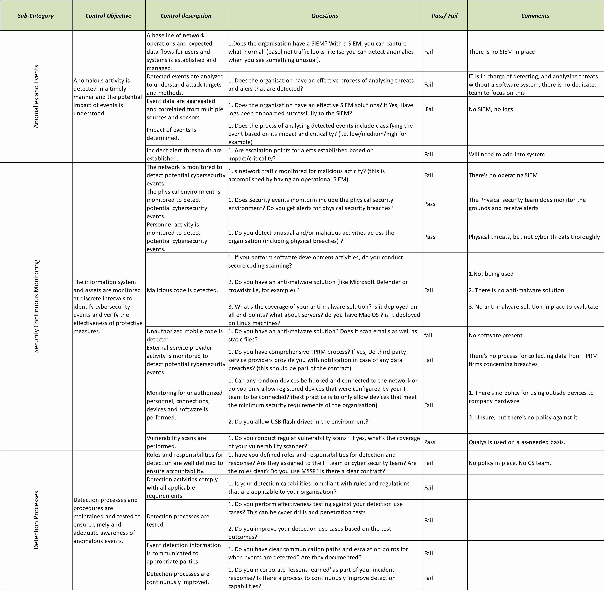
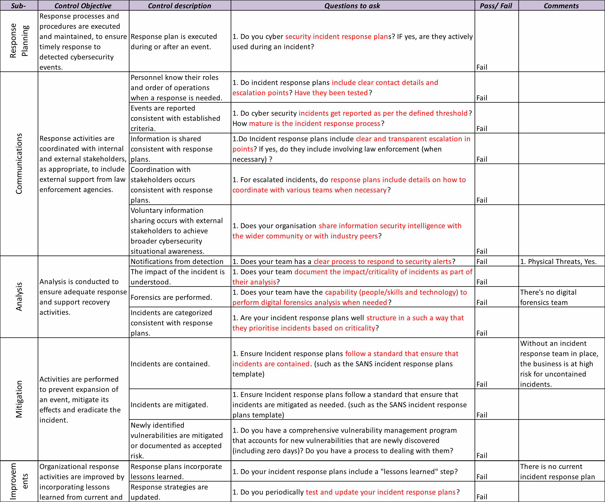
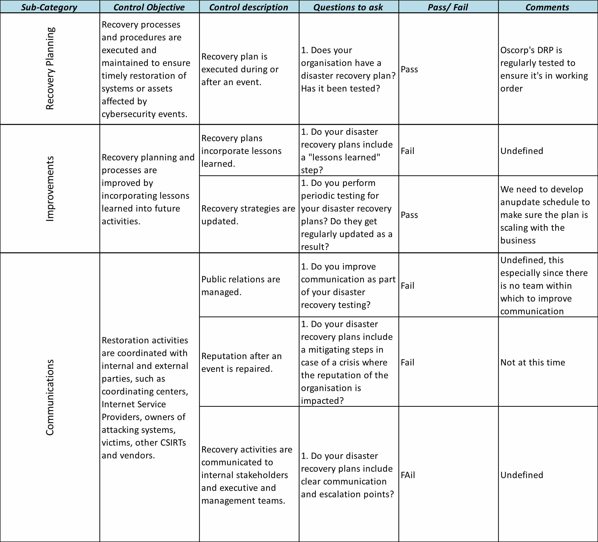

# NIST 800-53 Cybersecurity Assessment Summary
Previous: [Consequences of Inaction](Documents/Oscorp_Consequences_of_Inaction_Stakeholder_Brief.md) | Next: [Risk Methodology](https://github.com/jphumphries/jphumphries/blob/c57014cd37f240bcb048bec760017f4a3502a480/Projects/Oscorp_NIST-CSF_Program_Capstone_Project/Documents/Risk_Assessment_Methodology.md)
## Purpose

This document summarizes the five assessment tables in the original workbook and is designed for a GitHub-style repository. Each section provides a short interpretation of the table followed by a Markdown image reference.

Download Excel File [Here](Assessment/Oscorp_NIST-CSF_Program_Capstone_Project/Assessment/GRC%20Mastery%20NIST%20Cyber%20Security%20Assessment_2026.xlsx)

## Assessment Snapshot

| NIST Function | Pass | Fail | Not Assessed / Unknown |
|---------------|-----:|-----:|-----------------------:|
| **Identify**  |    3 |   20 |                      1 |
| **Protect**   |    9 |   25 |                      1 |
| **Detect**    |    3 |   14 |                      1 |
| **Respond**   |    0 |   15 |                      0 |
| **Recover**   |    2 |    4 |                      0 |

> **Reading note:** A pass indicates that the source assessment marked the control as passing. It does not necessarily mean the control is fully mature; several passing items include comments recommending additional definition, testing, or governance.

## Identify

**Assessment result:** 3 Pass · 20 Fail · 1 Not Assessed / Unknown

The **Identify** portion shows that Oscorp has a few useful starting capabilities, including a physical asset inventory and vulnerability scanning, but the broader governance and risk-management foundation is weak. The assessment identifies major gaps in software/SaaS inventory, network and data-flow mapping, asset classification, cybersecurity roles, supply-chain governance, business dependencies, policy, regulatory requirements, risk assessment, risk response, and organizational risk tolerance.

The most important conclusion from this section is that Oscorp does not yet have a reliable way to understand **what must be protected, who owns the risk, how critical each asset or service is, or how risk decisions should be made**. These deficiencies justify making governance, asset visibility, business impact analysis, and formal risk management early priorities in the three-year roadmap.

## Protect

**Assessment result:** 9 Pass · 25 Fail · 1 Not Assessed / Unknown

The **Protect** portion identifies broad weaknesses in access control, workforce awareness, data protection, secure configuration, change management, maintenance, logging, and removable-media controls. Existing strengths include some identity/credential practices, physical security, backups, physical-environment protections, HR-related security practices, vulnerability management, and some network protection.

The strongest treatment priorities are formalizing least privilege and separation of duties, defining remote-access requirements, strengthening privileged access, creating recurring security-awareness training, protecting data at rest and in transit, establishing DLP, separating development/test/production environments, creating secure configuration and change-control processes, and defining logging requirements. This section directly supports the Year 1 focus on **Microsoft Entra, Intune, Defender, policy development, endpoint governance, and data-protection controls**.

## Detect

**Assessment result:** 3 Pass · 14 Fail · 1 Not Assessed / Unknown

The **Detect** portion shows that Oscorp has very limited cybersecurity monitoring capability. Physical monitoring and vulnerability scanning provide some coverage, but the organization lacks a mature SIEM, centralized logging, event correlation, alert thresholds, cyber-focused personnel monitoring, malware detection, third-party security monitoring, and tested detection processes.

This is why the roadmap delays a major SIEM investment until foundational logging requirements, ownership, incident-response procedures, and endpoint controls are established. Once those foundations exist, **Microsoft Sentinel and an internal Security/SOC Analyst supported by MDR/MSSP coverage** can be introduced to improve visibility, alert triage, investigation, and escalation.

## Respond

**Assessment result:** 0 Pass · 15 Fail · 0 Not Assessed / Unknown

The **Respond** portion is the weakest area in the assessment: every assessed response control is marked as failed. Oscorp lacks a mature cyber incident-response plan, defined roles, reporting thresholds, stakeholder coordination, investigation procedures, forensic capability, incident categorization, containment, mitigation, lessons learned, and a process for updating response strategies.

This makes incident response an urgent program-level risk rather than a single control issue. The treatment strategy should establish an incident-response plan and RACI, define severity and escalation criteria, create practical playbooks, conduct exercises, and retain specialist support for major incidents and digital forensics. The goal is to ensure that an event can be **identified, escalated, contained, investigated, and learned from in a consistent way**.

## Recover

**Assessment result:** 2 Pass · 4 Fail · 0 Not Assessed / Unknown

The **Recover** portion contains one of Oscorp's clearest existing strengths: a disaster recovery plan is in place and is regularly tested. However, the assessment still identifies weaknesses in lessons learned, formal update cycles, public relations, reputation management, and communication with internal and executive stakeholders.

Rather than replacing the existing recovery capability, the roadmap should build around it. Recovery testing should be tied to business-impact requirements, corrective actions should be tracked after exercises, and crisis communications should be formally integrated with incident response and disaster recovery. This preserves an existing strength while improving **coordination, communication, and continuous improvement**.

## Overall Assessment Conclusion

The five functions show a consistent pattern: Oscorp has several isolated controls and operational strengths, but they are not yet supported by a mature cybersecurity governance structure. The largest weaknesses are concentrated in **governance and risk ownership, access control, data protection, centralized detection, incident response, and third-party risk management**.

The assessment therefore supports a phased program rather than a tool-first response: establish accountable leadership and risk processes, improve asset and identity control, strengthen endpoints and data protection, build incident response, centralize monitoring, and then move toward continuous control validation and improvement.

Previous: [Consequences of Inaction](Documents/Oscorp_Consequences_of_Inaction_Stakeholder_Brief.md) | Next: [Risk Methodology](https://github.com/jphumphries/jphumphries/blob/c57014cd37f240bcb048bec760017f4a3502a480/Projects/Oscorp_NIST-CSF_Program_Capstone_Project/Documents/Risk_Assessment_Methodology.md)
